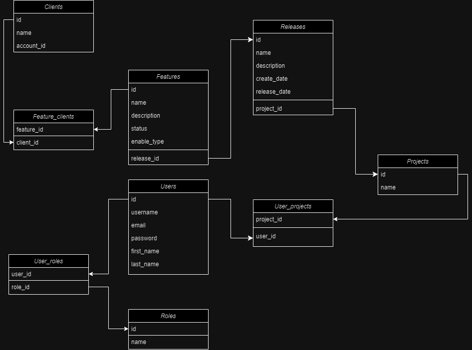

# Release-Management-Application
Release Management Web Application made with Spring Boot and React using a PostgreSQL database 
allows developers to track projects, releases and features.

## Features

1. ** User Authentication **
   - Register and login for Users using Spring security

2. ** Project Management **
   - Project Managers can CREATE new projects
   - Project Managers can EDIT or DELETE existing projects 
   - Search, filter and sort projects

3. ** Release Management **
   - Release Managers can CREATE new releases for projects
   - Release Managers can EDIT or DELETE existing releases
   - Search, filter and sort releases
   - Based on release dates you can turn features on or off
   - Track create dates and release dates

4. ** Feature Management **
   - Developers can add new features
   - Developers can edit existing features
   - Developers can turn features on or off
   - Features have different enable types (PER ACCOUNT or ALL)

5. ** Client Management **
    - Clients can be assigned or unassigned from different features
    - Clients can be added or deleted

6. ** User Management **
    - Administrator can see all existing users
    - Administrator can EDIT or DELETE user accounts
	- Search, filter and sort accounts

### Important endpoints
The following is the feature-flag endpoint that checks if feature is ON or OFF

		@GetMapping("/enabled/{featureName}/{accountId}")
		public ResponseEntity<Boolean> isFeatureEnabled(@PathVariable String featureName, @PathVariable String accountId) throws FeatureNotFoundException{
        var isEnabled = featureService.isFeatureEnabled(featureName, accountId);

        return ResponseEntity.ok(isEnabled);
		}


## Feature flag library

### About 
The feature flag library uses Rest Template to connect external apps with the Release Management Application

### Installation instructions 
1. Open the Feature-Flag-Library folder in IntelliJ
2. Open the Maven terminal inside of IntelliJ.
3. Write the following command:
   ```bash
   mvn clean install
   ```
4. If this was completed successfully the feature flag library will be installed to the following directory:
	>> C:\Users\USERNAME\ .m2\repository\com\featureflag
5. To include the feature flag library in your external project add the following to your pom.xml file:
	```xml
	 <dependency>
		<groupId>com.featureflag</groupId>
		<artifactId>Feature-Flag-Library</artifactId>
		<version>0.0.1-SNAPSHOT</version>
	 </dependency>
	```
6. Now you can test your application with the Release Management Application

## Car Sales Application

### About
The Car Sales app was created to test the feature flag inside the release management application. It already has the needed depedency inside the pom.xml file.

### Testing instructions
The Car Sales Application consists of create, read, update and delete endpoints.
The following is an example of how to test the feature flag capability of the Release Management Application:

1. Open Postman
2. To create a car call the following endpoint:
	> http://localhost:8081/car/{accountId}
3. Inside the body in postman add a Json file that looks like the following:
   ```json
	{
		"id": 7,
		"make" : "Fiat",
		"model" : "Punto"
	}
	```
4. If there is a feature inside of the database of the Release Management Application that is of Enable Type "ALL" or has an assigned Client with the same accountId and is turned ON postman will return the message
	> "car created"
5. If there is a feature inside of the database of the Release Management Application that is of Enable Type "ALL" or has an assigned Client with the same accountId and is turned OFF postman will return the message
	> "feature not available!"
6. Otherwise postman will return the following message:
	> "failed to determine feature state"
	
## Database

## Technologies
<p align="center">
	
	
	
	
	
	
</p>